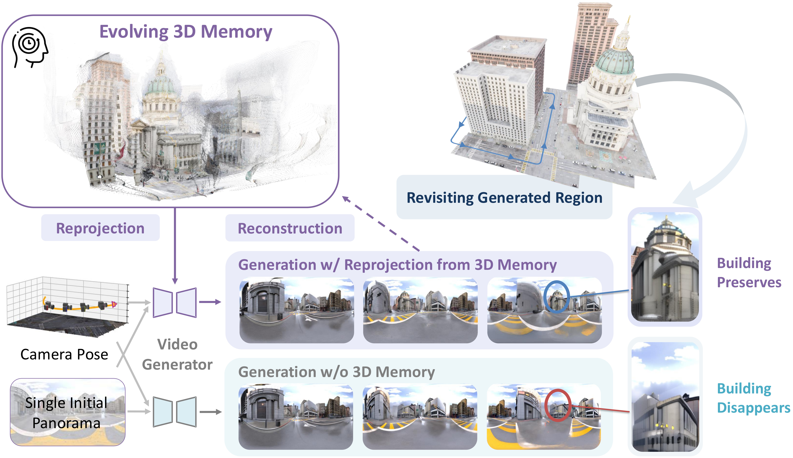

# EvoWorld

**Official implementation of**  
**[EvoWorld: Evolving Panoramic World Generation with Explicit 3D Memory](https://arxiv.org/abs/2510.01183)**  

EvoWorld is a generative world model that explicitly reconstructs and utilizes a 3D memory for egocentric video generation. Starting from a single panoramic image and a sequence of camera poses, EvoWorld synthesizes future frames with strong 3D consistency by projecting an evolving 3D point cloud onto future views as conditioning for a video diffusion model.

<p align="center">
  
</p>

## Table of Contents

- 🔧 Installation
- 📦 Pretrained Weights & Dataset
- ⚡ Quickstart
  - Single-clip generation
  - 3-clip iterative generation
- 🧪 Inference (full test set)
- 📊 Evaluation
- 🏋️ Training
- 🗺️ Spatial360 Dataset
- 📎 Acknowledgements

## 🔧 Installation

```bash
git clone git@github.com:JiahaoPlus/EvoWorld.git --recursive
cd EvoWorld
conda create -n evoworld python=3.11
conda activate evoworld
pip install -r requirements.txt
conda install -c conda-forge "cudnn>=9,<10"
```

## 📦 Pretrained Weights & Dataset

We have released:

- **Model weights (Hugging Face):**
  [Evoworld_Unity_Curve_Path](https://huggingface.co/CometsFeiyu/Evoworld_Unity_Curve_Path)
- **Corresponding dataset (Google Drive):**
  [Unity_Curve_Path_Data](https://drive.google.com/file/d/1xkVi83huO7WkRm6_XZ9AXJEhjvVmux0q/view?usp=drive_link), [UE5_Curve_Path_Data](https://drive.google.com/drive/folders/1XYwHZqbcn8sn1xfIyHTp3_a2aOCNPVPe?usp=drive_link)


### How to use

**1. Download model weights and dataset**
- Download model weights from Hugging Face and place them in the `MODELS/` directory.
- Download the dataset from Google Drive.
- After downloading the dataset, extract it (adjust paths as needed):
  ```bash
  tar -xvf /path/to/dataset.tar -C data/
  ```
- Update the model path in `run_single_segment.sh` and `run_unified_pipeline.sh` to point to your downloaded weights.

**2. Run model on provided example**
   - For **single clip generation**, run:
     ```bash
     bash run_single_segment.sh
     ```
   - For **3-clip iterative generation**, run:
     ```bash
     bash run_unified_pipeline.sh
     ```
  - Make sure the model path in these scripts matches your downloaded weights in `MODELS/`.

**3. Run model across the whole test set**
   - Change your model path in `inference_unity_curve.sh` to the downloaded weights.
   - Execute:
     ```bash
     bash inference_unity_curve.sh
     ```

**4. Get evaluation metrics**
   - Run:
     ```bash
     bash calculate_metrics.sh
     ```

## ⚡ Quickstart

### Single-clip generation (one clip)
```bash
bash run_single_segment.sh
```

### 3-clip iterative generation (memory carried across 3 clips)
```bash
bash run_unified_pipeline.sh
```

Notes:
- `run_single_segment.sh` runs a single-clip example.
- `run_unified_pipeline.sh` runs three clips iteratively, reusing the evolving 3D memory.
- Ensure the model path inside these scripts points to your downloaded weights in `MODELS/`.

## 🗺️ Spatial360 Dataset

We have released the Unity Curve Path and UE5 Curve Path subset — remaining subsets are coming soon!

<!-- ## 🗺️ Spatial360 Dataset

We release **Spatial360**, the first dataset for long-range and loop-closure exploration with 360° panoramic videos and poses. It spans:
- Synthetic outdoor: Unity and UE5
- Indoor: Habitat (HM3D and Matterport3D)
- Real-world: Captured using Insta360 -->

<!-- ## 📦 Dataset Preparation

### Download Panoramic Videos and Camera Poses
You can download pre-processed clips from the [Spatial360](https://github.com/todo) dataset:
```bash
gdown https://drive.google.com/uc?id=VIDEO_FILE_ID
```

### Download Pre-generated 3D Reprojections (Optional)
```bash
gdown https://drive.google.com/uc?id=REPROJECTION_FILE_ID
``` -->

<!-- ### Or Generate Reprojections for Training
#### Step 1: Convert panoramic images to perspective views
```bash
bash scripts/reprojection/pano_to_pers_for_train.sh
```

#### Step 2: Reconstruct 3D memory and project to target views
This step uses VGGT [CVPR 2025] to build colored point clouds and Open3D for rendering.
```bash
bash reproject_vggt_open3d_for_train_sbatch.sh
``` -->

## 🏋️ Training
To reproduce our performance, run the train script:
```bash
# Train EvoWorld
bash train.sh
```

## 🧪 Inference (full test set)

Update your model path in `inference_unity_curve.sh` and run:
```bash
bash inference_unity_curve.sh
```

## 📊 Evaluation

Compute evaluation metrics on the outputs:
```bash
bash calculate_metrics.sh
```

## 📎 Acknowledgements

This codebase builds upon:
- [VGGT](https://github.com/jianyuann/vggt)
- [360-1M](https://github.com/MattWallingford/360-1M)
- [SVD_Xtend](https://github.com/pixeli99/SVD_Xtend)
- [GenEx](https://github.com/GenEx-world/genex)